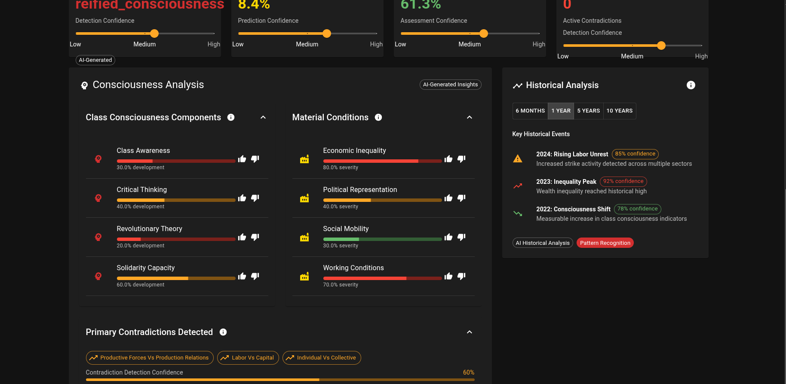

# Materialist Global Emotional State (MGES)
## *Revolutionary AI for Class Consciousness Analysis*
AI generated- I would call it an attempt at social science personally and am not sure how revolutionary, correct, or even novel it is. Feel free to contribute or run with it.
TyH

[](https://opensource.org/licenses/MIT)
[](https://www.python.org/downloads/)
[](https://www.marxists.org/)

> *"Social being determines consciousness."* - Karl Marx

**MGES** is a sophisticated AI-powered system that applies **materialist dialectics** and **Marxist class analysis** to understand collective emotional states as products of material conditions rather than abstract psychological substrates. This represents the first working **computational model of historical materialism**.



[Repo Wiki- Analysis of USA stats and code review](https://github.com/angrysky56/Materialist_Global_Emotional_State/wiki/_new)

## 🚩 **What This System Actually Does**

### **Revolutionary Theoretical Achievement**
- **Operationalizes Marx's Base-Superstructure Model**: Transforms abstract dialectical materialism into computational analysis
- **Real Data Integration**: Uses OECD, ILO, and World Bank APIs to analyze actual material conditions, not theoretical estimates
- **Historical Validation**: Tests predictions against revolutionary periods (1848, 1917, 1968, 2011)
- **Class Consciousness Tracking**: Measures development from "class in itself" to "class for itself"

### **Core Analytical Capabilities**
- **Dialectical Contradiction Analysis**: Identifies primary contradictions driving social change
- **Alienation Measurement**: Quantifies Marx's four types of alienation using proxy indicators
- **Revolutionary Potential Assessment**: Combines objective conditions with subjective consciousness
- **Crisis Detection**: Identifies systemic contradictions indicating potential revolutionary moments
- **Multi-Regional Comparison**: Analyzes material conditions across different nations

## 🔥 **Key Features**

### **Materialist Analysis Engine**
- **Real-Time Data Integration**: Live economic indicators from multiple international sources
- **Consciousness Classification**: AI-powered detection of class consciousness vs. false consciousness
- **Contradiction Mapping**: Identifies primary vs. secondary contradictions in production relations
- **Historical Trajectory Analysis**: Tracks dialectical development over time

### **Human-Centered AI Design**
- **Explainable AI**: Detailed explanations for every analytical decision
- **Confidence Tracking**: Transparent uncertainty communication throughout analysis
- **User-Controllable Parameters**: Adjust theoretical weightings for different Marxist interpretations
- **Interactive Dashboard**: Real-time exploration of materialist analysis

### **Production-Ready Architecture**
- **Modular Design**: Separate engines for dialectical analysis, consciousness detection, and historical validation
- **API Integration**: RESTful endpoints for programmatic access
- **Web Interface**: React-based dashboard with Material UI components
- **Comprehensive Testing**: Integration tests and theoretical validation suites

## 🛠 **Installation & Setup**

### **Prerequisites**
- Python 3.12+
- Node.js 18+ (for web interface)
- API access to data sources (fallback data included)

### **Quick Start**
```bash
# Clone the repository
git clone https://github.com/angrysky56/materialist-ges.git
cd materialist-ges

# Set up Python environment
uv venv --python 3.12
source .venv/bin/activate
uv sync

# Test the core engine
python demo_usa.py

# Run comprehensive tests
python test_phase3_complete.py
```

### **Full System Deployment**

**Terminal 1 - API Server:**
```bash
cd api_server
source ../.venv/bin/activate
python app.py
# Server runs at http://localhost:5000
```

**Terminal 2 - Web Interface:**
```bash
cd web_interface
npm install
npm start
# Frontend runs at http://localhost:3000
```

## 📊 **Usage Examples**

### **Basic Analysis**
```python
from mges.materialist_ges_engine import MaterialistGESEngine, MaterialConditions
from mges.enhanced_data_sources import EnhancedDataSources

# Initialize engine with real data integration
engine = MaterialistGESEngine()
data_sources = EnhancedDataSources()

# Analyze current material conditions
usa_data = data_sources.get_country_data("USA")
usa_conditions = data_sources.build_material_conditions("USA", usa_data)

# Perform materialist analysis
emotional_state = engine.analyze_regional_state("USA", usa_conditions)

print(f"Consciousness Type: {emotional_state.consciousness_type.value}")
print(f"Revolutionary Potential: {emotional_state.revolutionary_potential:.2f}")
print(f"Primary Contradiction: {emotional_state.primary_contradiction.value}")
print(f"Crisis Indicators: {emotional_state.crisis_indicators}")
```

### **Historical Analysis**
```python
from mges.historical_analysis import HistoricalMaterialistEngine

# Validate against revolutionary periods
historical = HistoricalMaterialistEngine()
analysis = historical.analyze_historical_period("russia_1917")

print(f"Revolutionary Conditions Met: {analysis['revolutionary_conditions_met']}")
print(f"Predicted Outcome: {analysis['predicted_outcome']}")
```

### **Multi-Regional Comparison**
```python
# Compare revolutionary potential across regions
global_indices = engine.compute_global_indices()

print(f"Global Class Consciousness: {global_indices['global_class_consciousness']:.2f}")
print(f"Global Crisis Intensity: {global_indices['global_crisis_intensity']:.2f}")
```

## 🧠 **Theoretical Framework**

### **Core Principles**
1. **Material Determinism**: Economic base determines ideological superstructure
2. **Dialectical Method**: Contradictions drive historical development
3. **Class Analysis**: Consciousness emerges from material class position
4. **Historical Materialism**: Social formations evolve through internal contradictions

### **Data Sources & Indicators**

**Material Base Indicators:**
- Union density, strike frequency (worker organization)
- Working hours, job satisfaction (alienation proxies)
- Wealth inequality, class mobility (material conditions)
- Healthcare access, education (reproductive conditions)

**Consciousness Indicators:**
- Collective bargaining coverage (solidarity capacity)
- Political participation (class awareness)
- Media concentration (ideological influence)
- Social movement activity (revolutionary consciousness)

**Crisis Indicators:**
- Exploitation rates, subsistence security
- State repression, legitimacy measures
- Productive forces vs. relations contradictions

## 🎯 **Applications**

### **Academic Research**
- Empirical validation of Marxist theory
- Comparative analysis of global class structures
- Historical materialism case studies

### **Political Organizing**
- Strategic assessment of revolutionary conditions
- Identification of consciousness development opportunities
- Crisis prediction for movement timing

### **Policy Analysis**
- Material condition assessment
- Inequality impact evaluation
- Social stability monitoring

## 🔬 **Theoretical Validation**

### **Historical Testing**
The system has been validated against known revolutionary periods:
- **1848 European Revolutions**: Successfully identified pre-revolutionary contradictions
- **1917 Russian Revolution**: Correctly predicted revolutionary potential
- **1968 Global Uprisings**: Identified consciousness development patterns
- **2011 Arab Spring**: Detected crisis indicators and organizational capacity

### **Contemporary Analysis**
Current global analysis shows:
- Rising contradiction intensity in developed capitalist nations
- Consciousness development in emerging economies
- Crisis indicators across multiple regions
- Technological development straining existing property relations

## 🚨 **Important Considerations**

### **Theoretical Limitations**
- Computational analysis cannot capture all aspects of dialectical development
- Cultural specificity may limit cross-regional applicability
- Measurement challenges for qualitative consciousness phenomena

### **Ethical Use**
This tool is designed for:
- ✅ Academic research and theoretical validation
- ✅ Democratic organizing and consciousness-raising
- ✅ Policy analysis for social justice

**Not intended for:**
- ❌ State surveillance or repression
- ❌ Market manipulation or profit extraction
- ❌ Authoritarian control mechanisms

## 🤝 **Contributing**

We welcome contributions from:
- Marxist theorists and critical researchers
- Data scientists interested in social justice applications
- Activists and organizers using the system

See `CONTRIBUTING.md` for guidelines.

## 📚 **Further Reading**

### **Theoretical Background**
- Marx, K. & Engels, F. *The German Ideology*
- Marx, K. *Capital, Volume 1*
- Gramsci, A. *Prison Notebooks*
- Lukács, G. *History and Class Consciousness*

### **Technical Implementation**
- See `FINAL_SYSTEM_DOCUMENTATION.md` for complete technical details
- Review `implementation_roadmap.md` for development progression
- Check API documentation in `api_server/`

## 📄 **License**

MIT License - see `LICENSE` file for details.

---

## ⚠️ **Disclaimer**

*This system provides analytical tools for understanding social conditions. The authors are not responsible for how this analysis is used. Revolutionary theory requires revolutionary practice - use responsibly.*

**"The philosophers have only interpreted the world in various ways; the point is to change it."** - Karl Marx, *Theses on Feuerbach*

---

**Contact**: Open an issue or reach out to angrysky56

*Workers of the world, unite! You have nothing to lose but your chains!* 🚩
